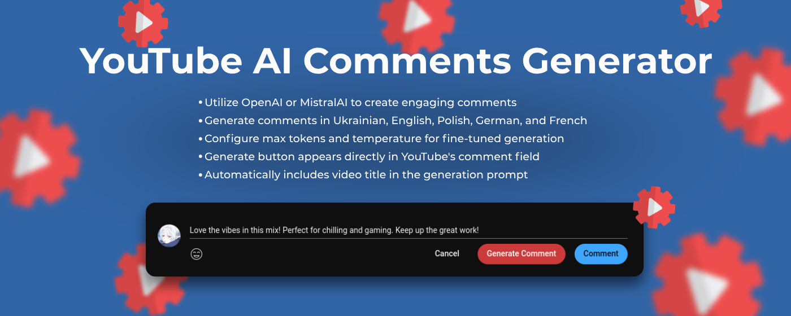
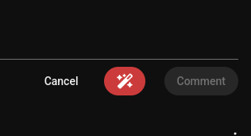
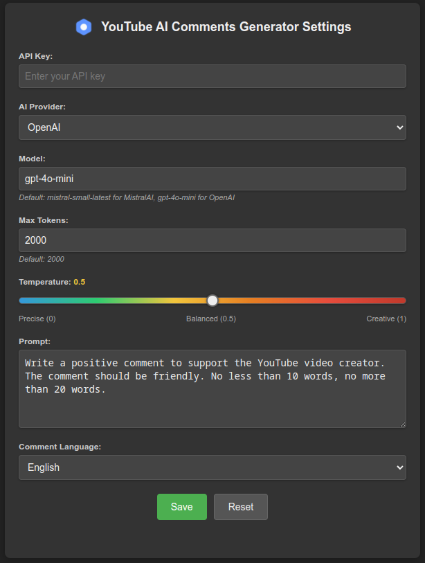
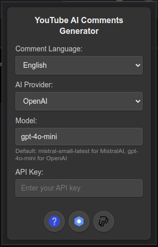

<div align="center">

# YouTube AI Comments Generator



[](https://github.com/Sigmanor/yt-ai-comments/actions/workflows/release.yml)
[](https://opensource.org/licenses/MPL-2.0)
[](https://chromewebstore.google.com/detail/youtube-ai-comments-gener/ikdjiofmkibkjecaknpmolmibjbkgalo)
[](https://addons.mozilla.org/en-US/firefox/addon/yt-ai-comments/)

YouTube AI Comments Generator is a browser extension that helps you craft engaging and insightful comments for YouTube videos using AI. It supports multiple languages and various AI providers, making it easy to interact with your favorite creators and show your support effortlessly!

</div>

## 🌟 Features

- **AI-Powered Comment Generation**: Utilize OpenAI or MistralAI to create engaging comments
- **Multiple Language Support**: Generate comments in Ukrainian, English, Polish, German, and French
- **Customizable AI Models**: Choose between different models (GPT-4o, Mistral Large, etc.)
- **Adjustable Parameters**: Configure max tokens and temperature for fine-tuned generation
- **Seamless YouTube Integration**: Generate button appears directly in YouTube's comment field
- **Video Context Awareness**: Automatically includes video title in the generation prompt
- **Comment Mood Selection**: Choose different moods for your comments (positive, neutral, critical)
- **Quick Language Switching**: Change comment language directly from the dropdown menu

## 📸 Screenshots

<details>
<summary style="cursor: pointer;">Click to expand</summary>







</details>

## 📋 Requirements

- Chrome (version 88+) or Firefox (version 109+)
- OpenAI or MistralAI API key

## 🔧 Installation

### Chrome Web Store

1. Visit the [Chrome Web Store page](https://chromewebstore.google.com/detail/youtube-ai-comments-gener/ikdjiofmkibkjecaknpmolmibjbkgalo)
2. Click the "Add to Chrome" button
3. Confirm the installation when prompted
4. The extension will be automatically installed and ready to use

### Firefox Add-ons Store

1. Visit the [Firefox Add-ons page](https://addons.mozilla.org/en-US/firefox/addon/yt-ai-comments/)
2. Click the "Add to Firefox" button
3. Confirm the installation when prompted
4. The extension will be automatically installed and ready to use

### From Releases

1. Go to the [Releases](https://github.com/Sigmanor/yt-ai-comments/releases) page
2. Download the latest version for your browser (`.crx` for Chrome, `.xpi` for Firefox)
   - The Firefox extension is now signed, making installation easier
3. Follow the browser-specific installation instructions below

### Manual Installation

### Chrome

1. Download or clone this repository
2. Install dependencies: `npm install`
3. Run `npm run prepare:chrome` to set up the Chrome manifest
4. Open Chrome and navigate to `chrome://extensions/`
5. Enable "Developer mode" (toggle in the top right corner)
6. Click "Load unpacked extension"
7. Select the `src` folder of this project

### Firefox

1. Download or clone this repository
2. Install dependencies: `npm install`
3. Run `npm run prepare:firefox:dev` to set up the Firefox development manifest
4. Open Firefox and navigate to `about:debugging#/runtime/this-firefox`
5. Click "Load Temporary Add-on"
6. Select the `manifest.json` file in the `src` folder

## 🚀 Usage

1. **Set Up the Extension**:

   - Click the extension icon in your browser toolbar
   - Click "More Settings" to access the full settings page
   - Enter your API key (OpenAI or MistralAI)
   - Configure your preferred language, model, and other settings
   - Save your settings

2. **Generate Comments**:
   - Navigate to any YouTube video
   - Click in the comment field
   - The "Generate Comment" button will appear next to YouTube's comment buttons
   - Use the dropdown menu to select your preferred mood and language (optional)
   - Click the button to generate a comment based on your settings
   - Edit the generated comment if needed
   - Post your comment using YouTube's "Comment" button

## ⚙️ Configuration Options

| Setting              | Description                            | Default                                                                                                                                      |
| -------------------- | -------------------------------------- | -------------------------------------------------------------------------------------------------------------------------------------------- |
| **Comment Language** | Language for generated comments        | English                                                                                                                                      |
| **Comment Mood**     | Tone of the generated comment          | Positive                                                                                                                                     |
| **AI Provider**      | Choose between OpenAI and MistralAI    | OpenAI                                                                                                                                       |
| **API Key**          | Your API key for the selected provider | -                                                                                                                                            |
| **Model**            | AI model to use for generation         | gpt-4o-mini (OpenAI) or mistral-small-latest (MistralAI)                                                                                     |
| **Max Tokens**       | Maximum length of generated comments   | 2000                                                                                                                                         |
| **Temperature**      | Creativity level (0.0-1.0)             | 0.5                                                                                                                                          |
| **Prompt**           | Template for comment generation        | Write a positive comment to support the YouTube video creator. The comment should be friendly. No less than 10 words, no more than 20 words. |

## 🔑 Getting API Keys

### OpenAI API Key

1. Go to [OpenAI Platform](https://platform.openai.com/)
2. Create an account or log in
3. Navigate to API Keys section
4. Create a new API key
5. Copy and paste it into the extension settings

### MistralAI API Key

1. Go to [Mistral AI Console](https://console.mistral.ai/)
2. Create an account or log in
3. Navigate to API Keys section
4. Create a new API key
5. Copy and paste it into the extension settings

## 🛠️ Development

### Project Structure

```
├── src/                     # Extension source code
│   ├── about/               # About page
│   ├── background/          # Background service worker
│   ├── content/             # YouTube page integration
│   ├── icons/               # Extension icons
│   ├── lib/                 # Shared libraries
│   ├── options/             # Settings page
│   ├── popup/               # Popup interface
│   ├── styles/              # Theme styling
│   └── manifest.json        # Extension manifest
└── scripts/                 # Build scripts
    ├── build.js             # Main build script
    ├── prepare.js           # Browser-specific preparation script
    └── update-manifests.js  # Manifest update script
```

### Building From Source

1. Clone the repository:

   ```bash
   git clone https://github.com/Sigmanor/yt-ai-comments.git
   cd yt-ai-comments
   ```

2. Install dependencies:
   ```bash
   npm install
   ```

3. Build extensions for both browsers:
   ```bash
   npm run build
   ```
   This will create extension packages in the `dist` directory.

4. Build for a specific browser:
   ```bash
   npm run build:chrome
   # or
   npm run build:firefox
   ```

## 📝 License

This project is licensed under the Mozilla Public License 2.0 - see the [LICENSE](LICENSE) file for details.

## 🙏 Credits

- Icons used in this extension are created by [Kawalanicon](https://www.flaticon.com/authors/kawalanicon) from Flaticon
- Built with ❤️ for the YouTube community
